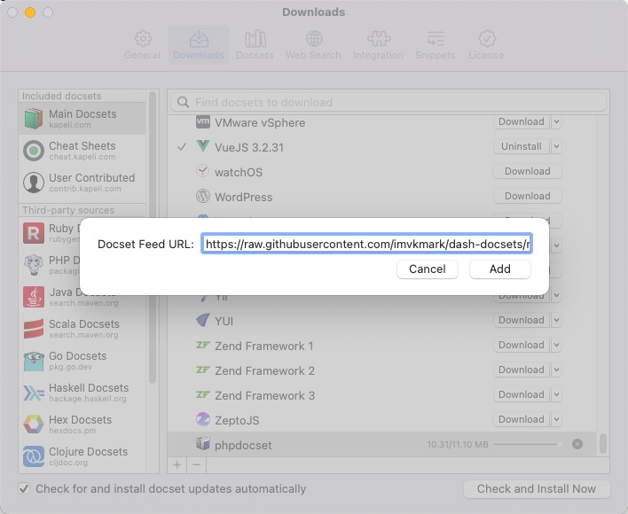

# Docset 生成工具

当前支持 Php, Kotlin, [LinuxCommand](https://github.com/jaywcjlove/linux-command)

## Docset 使用

**自行下载**

在 [Release](./releases) 页面下载, 自行安装

**订阅**

订阅 Url Feed :

Php : https://raw.githubusercontent.com/imvkmark/dash-docsets/master/php-docset.xml

Kotlin : https://raw.githubusercontent.com/imvkmark/dash-docsets/master/kotlin-docset.xml

LinuxCommand : https://raw.githubusercontent.com/imvkmark/dash-docsets/master/linux-command-docset.xml

发布新版本会自行更新




## 当前支持

### PHP

可用命令行生成

- PlayGround 支持菜鸟运行工具 [PHP 菜鸟工具](https://c.runoob.com/compile/1/)

### Kotlin

可用命令行生成

- PlayGround 更换为官方Url : https://play.kotlinlang.org/

### LinuxCommand

基于 https://github.com/jaywcjlove/linux-command 不定期生成文档并更新

## 运行说明

```
$ cd laravel
$ php artisan php {type}

: type
 -  download : 下载并解压到指定目录
 -  index :    进行索引
 -  tar :      对文档进行打包
```

requirement :

```
php > 8.0.2
```

## 更新注意

**Php 获取索引**

将最新的 PHP.docset 的索引文件(Dash 官方)放置在 `_php/docSet.dsidx` 位置

- 打开 Dash, `Preference` -> `Docsets` -> `Php`
- 右键选择 `Show In Finder`
- 右键 `PHP.docset` -> `显示包内容`, 找到 `Contents/Resources/docSet.dsidx`

## 参考

- [Docset Generation Guide](https://kapeli.com/docsets)

