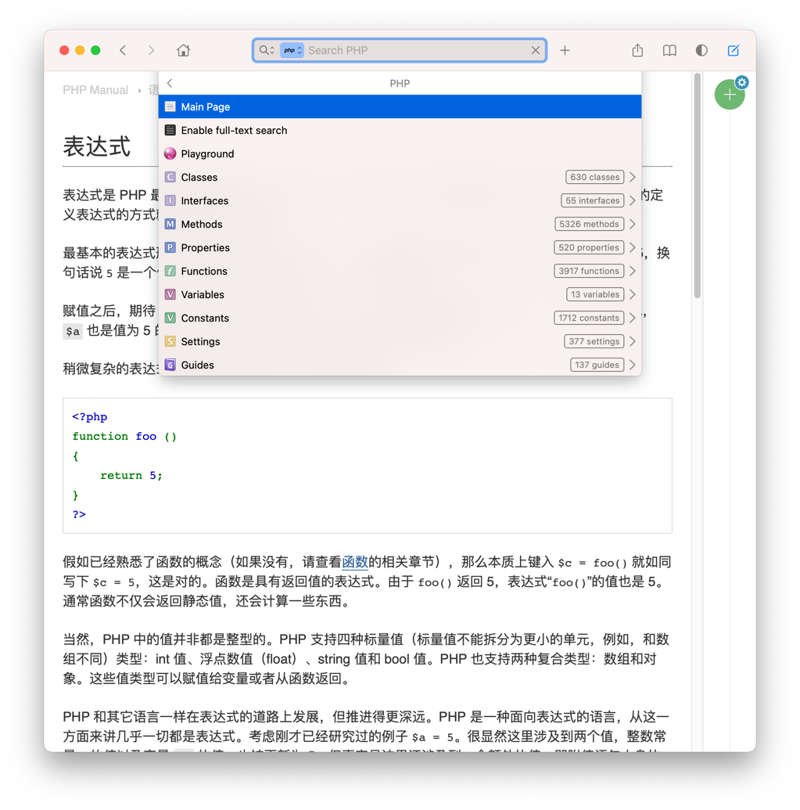
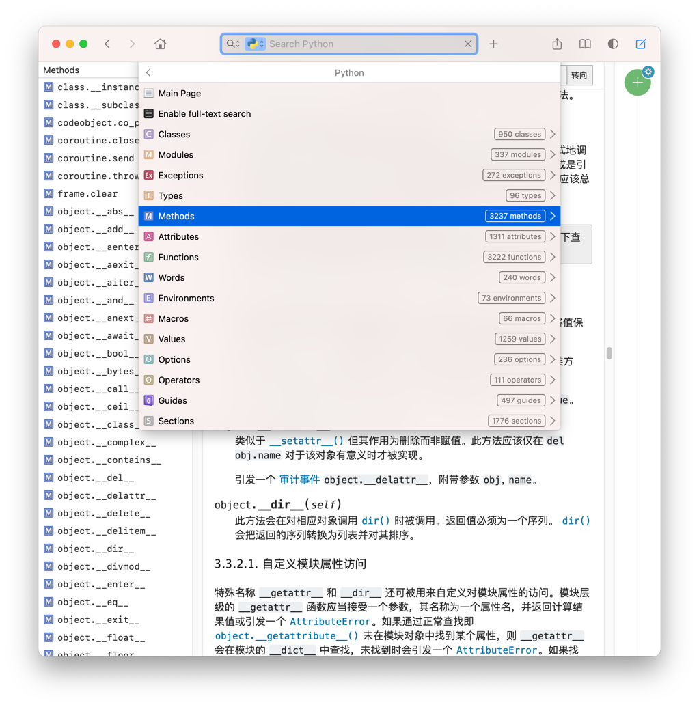
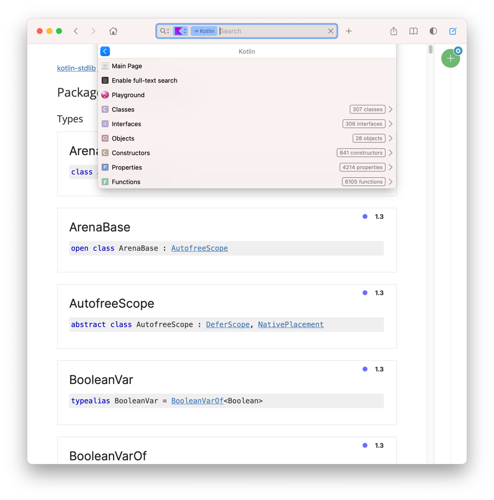

# Docset 生成工具

当前支持 
- Php(8.2.0)
- Python(3.11.1)
- Kotlin
- [LinuxCommand](https://github.com/jaywcjlove/linux-command)

如果需要安装指定版本在 [Release](https://github.com/imvkmark/dash-docsets/releases) 页面下载, 自行安装, 如果需要自动更新使用订阅模式

## Docset 订阅

发布新版本会自行更新


订阅 Url Feed 地址 :
```
php: 
https://raw.githubusercontent.com/imvkmark/dash-docsets/master/feeds/php-zh.xml

Kotlin:
https://raw.githubusercontent.com/imvkmark/dash-docsets/master/feeds/kotlin.xml

Linux Command:
https://raw.githubusercontent.com/imvkmark/dash-docsets/master/feeds/linux-command.xml

Python:
https://raw.githubusercontent.com/imvkmark/dash-docsets/master/feeds/python-zh.xml
```


## 当前支持

### PHP

可用命令行生成

- PlayGround 支持菜鸟运行工具 [PHP 菜鸟工具](https://c.runoob.com/compile/1/)



### Python



### Kotlin

可用命令行生成

- PlayGround 更换为官方Url : https://play.kotlinlang.org/



### LinuxCommand

使用官方的 command, 如需更新需要手工卸载并安装


## 生成索引

### 运行说明

```
$ cd laravel
$ php artisan php {type}

: type
 -  download : 下载并解压到指定目录
 -  index :    进行索引
 -  tar :      对文档进行打包
```

requirement :

```
php > 8.0.2
```

### Php 生成

将最新的 PHP.docset 的索引文件(Dash 官方)放置在 `_php/docSet.dsidx` 位置

- 打开 Dash, `Preference` -> `Docsets` -> `Php`
- 右键选择 `Show In Finder`
- 右键 `PHP.docset` -> `显示包内容`, 找到 `Contents/Resources/docSet.dsidx`
- 复制到项目 `_php` 目录下
- 运行命令 `php artisan php download --force && php artisan php index && php artisan php tar`
- 这样 `_php` 目录下的 `Php.Cn.docset.tgz` 文件便是最新的中文文档

### Python

下载 : https://docs.python.org/zh-cn/3/download.html
安装 [doc2dash](https://pypi.org/project/doc2dash/)  
运行命令:

```
$ doc2dash -f /path/of/python-zh-doc/
Converting intersphinx docs from '/path/of/python-zh-doc/' to 'Python.docset'.
Parsing documentation...
Added 13,683 index entries.
Patching for TOCs... ━━━━━━━━━━━━━━━━━━━━━━━━━━━━━━━━━━━━━━━━ 100% 0:00:00
```

## 参考

- [Docset Generation Guide](https://kapeli.com/docsets)

## Changelog

2022年12月31日

- 移除 wulicode
- 增加 python 中文版 3.11.1
- 更新 php 8.2.0 中文文档

2022年11月08日

- 移除 linux command 在项目中的支持, 使用官方源进行更新

